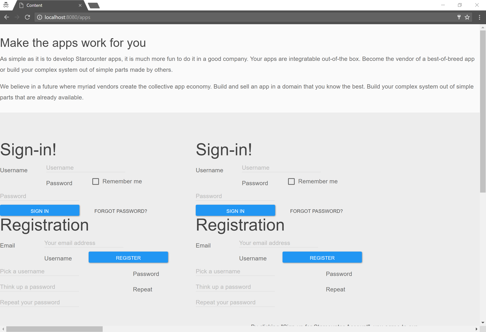

# Website
Suite of two apps allowing to create surfaces with blending points and attach the result from different applications in the blending points.

Note: Website only wraps responses where the response resource is `Json` (not null) with a session.

## Features

This solution consists of two apps

1. **WebsiteProvider** - wraps the responses according to the configuration stored in the database.
2. **Website CMS** - serves the admin panel. It is used to create the configuration for WebsiteProvider in the database.

### WebsiteProvider

WebsiteProvider wraps the app responses according to the configuration stored in the database.

When the end user visits one of the wrapped URLs (or any URL, if there is a default surface), the response from that URL is wrapped in our surface.

The view-model includes all of the blending points and the filling responses from the pinned URIs.

### Website CMS

Website CMS allows to configure the wrapping of the app responses in surfaces.

CMS interface is divided into four tabs:

#### Surfaces

Surfaces are the HTML documents that contain blending points. A single surface can contain one or more blending points.

Every surface has a **Name** and a path to the **View URI** that defines the presentation of the blending points. This URL can be resolved to a static file or to a dynamic handler, to which a different app responds (try it with Content app!).

A surface wraps only the URIs that are assigned to it using **Catching rules**.

#### Blending points

Blending points define where responses can be attached in a surface. Each blending point has a **Name**.

A blending point can be **Default**, meaning that it will attach the initial response that the surface is wrapping.

#### Catching rules

Catching rules define which requests are wrapped in surfaces.

Each rule defines that a certain entry **Catch URI** should be wrapped in a certain surface.

Catching rules support single wildcard URLs. If **Catch URI** contains a wildcard (`{?}`), it will match a request that contains any value at that place in the URL.

A catching rule can be **Final**, meaning that not any other catching rule will be applied additionally. If a **final** catching rule have an empty **Catch URI** value, it will be forced on any JSON response from any Starcounter app.

#### Pinning rules

Pinning rules define additional requests from any apps and to which blending point they should be inserted.

Each rule defines that for a certain **Catch URI**, a certain **Blending point** should be filled in by **Pin URI** (a request to any Starcounter app).

Pinning rules support single wildcard URLs. If both **Catch URI** and **Pin URI** contain a wildcard (`{?}`), the value at this place in the **Catch URI** will be passed to the **Pin URI**.

If a rule has no value in the **Catch URI** column, it becomes a "catch-all" rule. This means that it is applied for any entry URL.

## Sample gateway config

The following Starcounter Gateway config enables URL aliases used in the demo. Put this config to `scnetworkgateway.xml` and call `http://localhost:8181/gw/updateconf` to reload the config.

```xml
<UriAliases>
	<UriAlias>
		<HttpMethod>GET</HttpMethod>
		<FromUri>/user-profile</FromUri>
		<ToUri>/content/dynamic/userprofile</ToUri>
		<Port>8080</Port>
	</UriAlias>

  <UriAlias>
		<HttpMethod>GET</HttpMethod>
		<FromUri>/apps</FromUri>
		<ToUri>/content/dynamic/apps</ToUri>
		<Port>8080</Port>
	</UriAlias>

  <UriAlias>
		<HttpMethod>GET</HttpMethod>
		<FromUri>/apps/wanted-apps</FromUri>
		<ToUri>/content/dynamic/apps/wanted-apps</ToUri>
		<Port>8080</Port>
	</UriAlias>
</UriAliases>
```

## Sample environment setup steps

1. Apply the sample gateway config (see above)
2. Call [http://localhost:8181/gw/updateconf](http://localhost:8181/gw/updateconf) to reload the config
3. Start SignIn
4. Start Website
5. Start Content
6. Start Registration
7. Start UserProfile
8. Call [http://localhost:8080/signin/generateadminuser](http://localhost:8080/signin/generateadminuser) to generate the admin user
9. Call [http://localhost:8080/website/cms](http://localhost:8080/website/cms) to see that Website admin panel works.
  - You can sign in here.
10. Call [http://localhost:8080/content/cms](http://localhost:8080/content/cms) to see that Content admin panel works.
  - You should already be signed in.
  - You can sign out here.
11. Call [http://localhost:8080/apps](http://localhost:8080/apps) to see SignIn, Website, Content, Registration and UserProfile in concerto.

This is how it looks as of Jan 2017:



## Testing

### Prepare your environment

Before running the steps, you need to:

- Download and install Visual Studio 2015 to run the tests
- Download and install Java, required by Selenium Standalone Server
- Download Selenium Standalone Server and the drivers (Microsoft WebDriver (Edge), Google ChromeDriver (Chrome) and Mozilla GeckoDriver (Firefox)) using the instructions at https://docs.starcounter.io/guides/web-apps/acceptance-testing-with-selenium/
- Add path to the folder with drivers to system path on your computer

### Run the test (from Visual Studio)

1. Start Selenium Remote Driver: `java -jar selenium-server-standalone-3.*.jar`
2. Open `Website.sln` in Visual Studio and enable Test Explorer (Test > Window > Test Explorer)
3. You need to install NUnit 3 Test Adapter in VS addon window in order to see tests in Test Explorer window
3. Start the Website, WebsiteProvider_AcceptanceHelperOne, WebsiteProvider_AcceptanceHelperTwo and WebsiteProvider apps
4. Press "Run all" in Test Explorer
   - If you get an error about some packages not installed, right click on the project in Solution Explorer. Choose "Manage NuGet Packages" and click on "Restore".

### Run the test (from command line)

1. Start Selenium Remote Driver: `java -jar selenium-server-standalone-3.*.jar`
2. Build the solution (build.bat)
3. Start the WebsiteProvider.Tests runner (test.bat)

## Developer instructions

### How to release a package

This repo comes with a tool that automatically increments the information `package.config` (version number, version date, Starcounter dependency version) and creates a ZIP file containing the packaged app. To use it follow the below steps:

1. Make sure you have installed [Node.js](https://nodejs.org/)
2. Run `npm install` to install the tool (installs grunt, grunt-replace, grunt-bump, grunt-shell)
2. Run `grunt package` to generate a packaged version, (you can use `:minor`, `:major`, etc. as [grunt-bump](https://github.com/vojtajina/grunt-bump) does)
4. The package is created in `packages/<AppName>.zip`. Upload it to the Starcounter App Store

## License

MIT
